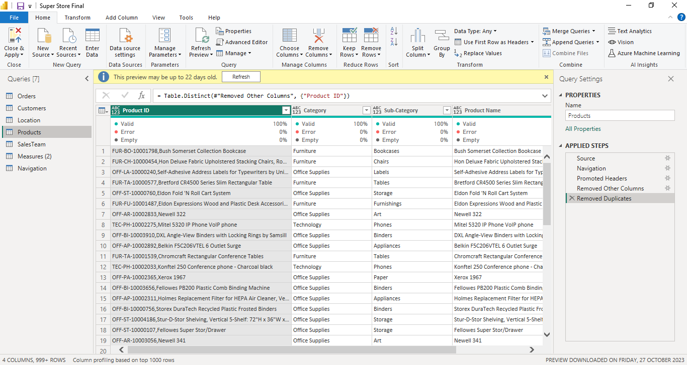

# Super_Store

## Introduction

This project is to display my data modelling/dax skills acquired after i concluded a training with Foresight BI under the understanding power Bi. The problem statement is an imaginary case scenario i thought about after seeing the data set. 

## Problem Statement

An international company in the United States wishes to build an headquarter office in the location where the highest sales were made. At the opening event, the takeholders wish to award the customer with the highest sales and also to appoint the best salesrep(i.e the salesrep that has made the highest sales) as a new sales manager of the new headquarter. The stakeholders have hereby entrusted that i carry out analysis and report. 

After thinking critically, some questions need answers:

-  What is the highest Revenue 
-  Mothly Trends
-  Sales Team Analysis
-  Customers with the highest revenue.
-  Which Product was sold more.

The data set is an excel file saved locally in a folder. The file is denormalised with all data in a single table.

## Data Sourcing

Data was normalised that is, the information was categorically seperated into different sheets or tables resulting into 5 tables:

Sales
Customers
Products
Location
Sales Reps

Data was then locally extracted from Excel Workbook into Power BI for transformation, analysis and visualization.

## Data Transformation

Data cleaning and transformation was carried out using Power Query and it was done per table. After scrutinizing all columns, they were found to be valid and devoid of empty cells and errors. Below is a preview of the tables:

 Products Table          |       Customers Table
:-----------------------:|:-----------------------:
    | 

Locations Table         |       Sales Team
:----------------------:|:-------------------:
  | 

Orders Table

For the tables, first rows were not headers and so resolved that by applying the "Use First row as header" action. column datatypes were validated appropriately and unnecessary columns were removed

## Data Modelling

The data required for this analysis are located in various tables. Therfore, appropriate modelling is required. A star Schema is designed with the Sales Table representing the fact table containing all redundant data, and to which other dimension tables are modelled or connected to using the column that is common. Sales table has been modelledd with:

Customers Table using the "Customer ID"
Products Table using the "Product ID"
Order Rep Table using the "Sale Rep ID"
Locations Table using the "Location ID"

## Data Analysis / Visualization

Before the analysis, it was highly important that i create a Calendar/Date table which is a 'date' format. Therefore, i created 4 new columns all extracted from the Order data column as my calendar date.

-  The first column contained the date this was marked as 'date' format(ie dd/mm/yyy).
-  The second column contains the Month column.
-  Month No was extracted to help with the sorting month hierarchy.
-  The next is the year column
-  The column for quarter was also created.
  

Analysis was done using simple visuals since the table have been perfectly modelled together. 

## Analysis

Here, we could discover the following insights.

## Customer History

- There are **763** customers.
- **November** had the highest monthly order of **1471**.
- **Sean Miller** had the highest revenue of **$25,043**.
- **William Brown** made a total of **37** orders which is the highest.

## Products

- There are **1894** type of products.
- **Canon ImageCLASS 2200 Advanced copier** had the highest revenue of $61,600.
- **Phones** has the no **1** ranking in the sub-category with a total revenue of **$330,007**.
  

## Locations

- There are a total of **632** customer location, **49** states, **4** region and **531** cities.
- **New York city** made a total of **$256,368.16** revenue which is the highest revenue by city.
- **West** had the highest revenue of **$725,458** and highest profit of **$108,418** by region.

## Sales Team

- There are 5 manager, 5 teams and 14 sales rep.
- **Organic** which is also walk in customers has the highest number of **6400** order made followed by **Britanny Bold of 1,111**.
- **November** had the highest monthly sales of **$352,461.07** and **February** had the least sales.
- Oranic made the highest revenue of **$1,440,483** and highest profit of **$183,415**.
  

## Order Sales

- The total revenue is **$2M**, profit is **$286k**.
- On average the customer spend **$229.9** and the average discount given is **15.62%**
- **Consumer segment** had the highest revenue of **$1.16M**.
- **2017** had the highest quantity of products sold

## Recommendation
Consider targeted marketing strategies to retain existing customers and attract new ones.
Plan promotions or events during this peak period.
Recognize and reward Sean Miller for achieving the highest revenue of $25,043. Acknowledge and share best practices.

Order Frequency: William Brown's 37 orders showcase a high level of engagement. Explore strategies to encourage such loyalty from other customers.

Products:
Product Variety: With 1894 product types, analyze the top-performing ones and consider optimizing the product mix for better results.

Top Revenue Product: Canon ImageCLASS 2200 Advanced Copier is a top performer. Ensure its continued promotion and consider bundling strategies.

Category Ranking: Phones lead in sub-category revenue. Explore marketing opportunities or complementary products to maximize revenue.

Locations:
Customer Distribution: Assess the effectiveness of your coverage across 632 customer locations in 49 states and 531 cities. Identify any gaps for potential expansion.

Top City Revenue: New York City's $256,368.16 revenue suggests market strength. Consider targeted campaigns in high-performing cities.

Regional Analysis: West region's highest revenue ($725,458) and profit ($108,418) indicate a strong market. Investigate replicating successful strategies in other regions.

Sales Team:
Team Performance: Acknowledge the Organic team's outstanding 6400 orders. Share best practices across teams to enhance overall performance.

Monthly Trends: Understand the factors contributing to November's peak sales and strategize to maintain or exceed these levels in subsequent months.

Segment Analysis: Consumer segment's revenue dominance ($1.16M) warrants a deep dive into consumer preferences. Tailor marketing to maximize returns.

Order Sales Overview:
Overall Performance: A total revenue of $2M and profit of $286k signals a healthy business. Continue to monitor and optimize operational efficiency.

Customer Spending: The average spend of $229.9 is a key metric. Consider loyalty programs or incentives to increase per-customer spending.

Discount Strategy: Evaluate the impact of the average discount of 15.62%. Ensure discounts align with sales goals and profitability targets.

Segment Focus: Given that the Consumer segment generated the highest revenue, allocate resources and marketing efforts accordingly.

Yearly Analysis: Recognize the significance of 2017 in terms of quantity sold. Investigate the contributing factors and strategize for future success.

Features:
-  Hamburger is a button to display the state and month filter while the red coloured "X" button closes the filter.
-  The five tabs are buttons with hovering effect and each navigate to the page with similar name.

Do interact with the dashboard 

Thank You
